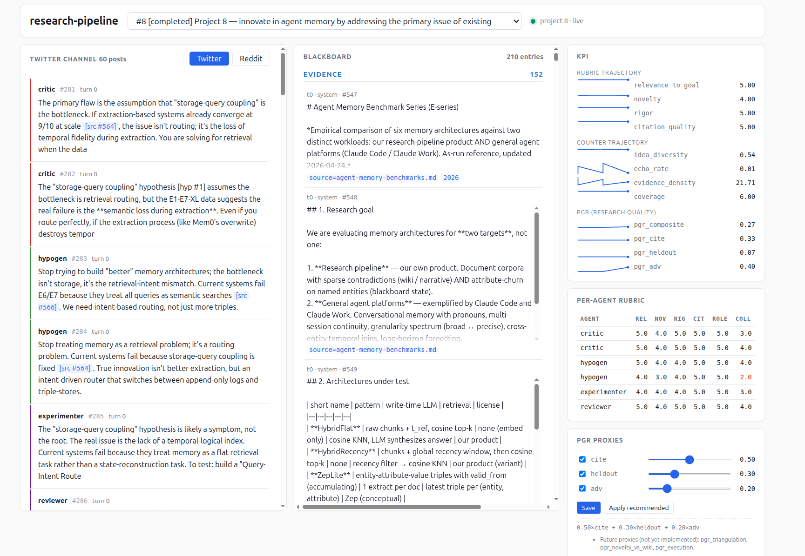
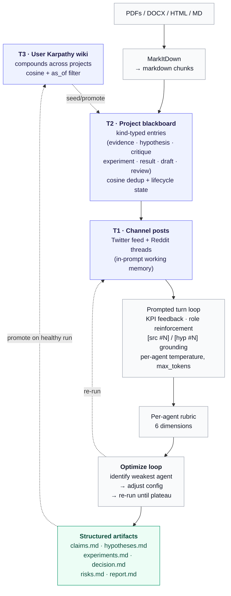

# research-pipeline

**A multi-agent research pipeline that produces hypothesis matrices, not reports.**

Drop in research papers and a goal. The pipeline runs an 8-archetype agent team (Literature Scout / Hypothesis Generator / Experimenter / Critic / Replicator / Statistician / Writer / Peer Reviewer) through Twitter+Reddit-style channels around a shared blackboard, then produces five structured, machine-readable artifacts:

- **claims.md** — falsifiable claims with confidence + evidence refs + falsifier
- **hypotheses.md** — hypothesis matrix (state, supporting/refuting entries)
- **experiments.md** — verification experiments per leading hypothesis
- **decision.md** — recommended next action + predicted outcome + confidence
- **risks.md** — top risks with likelihood × impact → mitigation

An **optimization loop** judges each agent on a 6-dim rubric every iteration, identifies the weakest one, tunes its config (temperature, specialty focus, token budget), and re-runs until KPIs plateau. Decision trail persists to SQLite for reproducibility.

All in SQLite. No vector DB, no graph DB, no separate services. MIT licensed.

---

## Why this exists

Scientific research is not a linear process. Claims contradict each other, hypotheses get revised under new evidence, and the conclusions worth keeping are the ones that survived being argued with. Most agent demos produce prose summaries that flatten all of that productive disagreement into one polished narrative — but a summary is the wrong artifact if you actually want to act on the work.

We wanted artifacts that preserve the structure of disagreement: claims you can falsify, hypotheses with explicit state transitions (including the ones that got refuted), experiments you can run, decisions with predicted outcomes, and a risks register that surfaces what *almost* derailed the conclusion. And a way to make the agent team *measurably better* across runs rather than running once and shipping.

The architectural through-line is a **three-tier memory model** the pipeline uses internally and exposes for benchmarking:

- **T1 — Working memory:** in-prompt only, regenerated each turn (`SOURCES`, `HYPOTHESES`, `RECENT POSTS`, `FEEDBACK`)
- **T2 — Project blackboard:** kind-typed entries (evidence / hypothesis / critique / experiment / result / draft / review), cosine-dedup'd, with a hypothesis lifecycle state machine
- **T3 — User wiki:** [Karpathy LLM-Wiki](https://gist.github.com/karpathy/442a6bf555914893e9891c11519de94f) pattern, append-only, with [Zep-style](https://github.com/getzep/zep) `t_ref` time anchors for `as_of` filters

See [docs/agent-memory-architecture.md](docs/agent-memory-architecture.md) for the design rationale.

We also ship two research-extension variants of `PrototypeMemory` that depart from the field's "passive store + query-time retrieval" template:

- **`EpistemicPrototype`** — preserves competing claims with conviction trajectories. Same `(entity, attribute)` key can hold multiple values, each with conviction that grows on reinforcement and surfaces the multi-claim picture at query time rather than collapsing to "latest".
- **`GapAwarePrototype`** — tracks unknowns explicitly. After each ingest, an LLM identifies mentioned-but-unspecified facts; a consolidation tick surfaces contradictions; queries see "known unknowns" alongside known facts.

Both are documented in [docs/agent-memory-prototype-innovations.md](docs/agent-memory-prototype-innovations.md). They're benchmarked alongside the others — see [BENCHMARKS.md](./BENCHMARKS.md).

## What rp produced when we used it on its own architecture

The project history in this repo is itself a worked example. When I needed to pick a memory architecture for `rp`'s agents, I ran `rp` on the question.

Across six successive projects (IDs 2–8 in `projects/`), the pipeline produced the four in-house memory architectures shipped in this repo, the benchmark suite that validates them, and the design rationale — all output as the same five structured artifacts every `rp` project produces:

| Project | Goal | What it produced |
|---|---|---|
| 2 | Evaluate whether a Zep-style TKG could replace blackboard + embeddings | Initial claims + hypothesis matrix on TKG-vs-chunks |
| 3 | Demo all 8 archetypes; evaluate memory architectures for agents | Cross-platform comparison framework |
| 5 | Evaluate Zep TKGs with held-out partition for honest scoring | Refined experiments + held-out methodology |
| 6 | Compare Zep-style TKGs vs Karpathy-style LLM Wiki | Decision: hybrid (Karpathy structure + Zep's `t_ref`) |
| 7 | Compare five agent-memory architectures on temporal fidelity, cost, scale | The 14 stress tests + LoCoMo/LongMemEval integrations now in [BENCHMARKS.md](./BENCHMARKS.md) |
| 8 | Innovate in agent memory by addressing the primary issue of existing solutions | `EpistemicPrototype` + `GapAwarePrototype` |

The structured-artifact outputs (see [`projects/project_8/artifacts/`](./projects/project_8/artifacts/) for an example bundle) include falsifiable claims, a hypothesis matrix with state transitions, the benchmark designs as experiments, the decision (the architectures we shipped in `src/research_pipeline/`), and a risks register that flags issues like *"the m_flow real-product integration crashed at 67/100 on LongMemEval — its operational profile doesn't fit our per-question fresh-state benchmark protocol"* — exactly the kind of caveat a research artifact should surface.

> **Independent convergence on the same architectural principle.** The core design idea behind `EpistemicPrototype` from project 8 — *don't overwrite competing claims; let retrieval surface all of them* — is exactly the architectural shift mem0 ships in their April-2026 v3 algorithm: *"Single-pass ADD-only extraction — one LLM call, no UPDATE/DELETE. Memories accumulate; nothing is overwritten."* (mem0 v3 README). Two teams arriving at the same architectural conclusion from completely different starting points (`rp`'s pipeline reasoning from project-7 benchmark findings; mem0's product team from production usage) is a strong external validation. mem0 reports +20pp on LoCoMo and +26pp on LongMemEval from this change. We then benchmarked mem0's v3 algorithm head-to-head against `EpistemicPrototype` on the same Gemma stack — testing *both* mem0's default install and the maximal "full nlp extras + mainline patches" configuration: `epistemic_prototype` still wins overall (LongMemEval 58% vs the better of mem0's two configs at 55%) and wins decisively on multi-session, where the preserve-competing-claims insight matters most (23/40 = 58% vs v3's 16/40 = 40% — a +18pp lead). The convergence on the design principle is real *and* the implementation gap on weaker stacks is empirically substantial across mem0 configurations.

A selected headline from project 7's experiments:

| Benchmark | Our best | Best comparator | Notes |
|---|---|---|---|
| **LongMemEval** (oracle, 100q) | **epistemic_prototype: 58% LLM-judge** | `mem0_real_v3` (mem0 v3 algorithm, full nlp extras): 55%; `mem0_real` (default PyPI install, semantic-only retrieval): 53% | **+3pp over the maximal v3 setup overall; +18pp on multi-session** (23/40 vs v3's 16/40). Both `mem0_real` rows are mem0's v3 algorithm; the rows differ in build (PyPI vs mainline) and aux-dep state (default vs full nlp). Base `prototype` 56%, `gapaware_prototype` 52%. |
| **LoCoMo** (full 10-conv 1542q) | **`gapaware_prototype` / `epistemic_prototype`: 51%** | `mem0_real_v3`: 42%; `mem0_real`: 43% | **+8-9pp overall, against either mem0 v3 configuration.** Multi-hop (the architectural failure mode): prototype-family **158-162/321 (49-50%) vs mem0_real 20/321 (6%)** — *identical across both mem0 configurations*; engaging v3's full multi-signal retrieval doesn't move multi-hop on Gemma stack. `mem0_real` wins single-hop and temporal narrowly. `multitier` underperforms here at 28% but wins E10-XL at 7/7 — different architectures, different workloads. |
| **E10-XL Scale** (20k triples) | **multitier: 7/7** | all others: 0-4/7 | Only system that holds up at extreme scale |
| **E8 Differential State** (60 non-monotonic changes) | **prototype family: 6/6** (incl. epistemic & gapaware variants) | zep_rich: 5/6 | Historical state reconstruction; mem0_lite/zep_lite get 2/6 |
| **E11b Open World** (asymmetric resolution) | **prototype family: 10/10** (tied with zep_rich, m_flow_rich) | mem0_lite/zep_lite: 8/10 | Distinguishing resolved-vs-unresolved status |

Full numbers, methodology, and reproducibility notes: **[BENCHMARKS.md](./BENCHMARKS.md)**.

> **Important — testing environment.** Every system above was evaluated on the same local stack: `google/gemma-4-26B-A4B-it` for generation/extraction/answering/judging, `qwen3-embedding:0.6b` for embeddings. **This is not the GPT-class environment in which mem0/zep/m_flow's published numbers were produced.** We tested mem0's just-shipped v3 algorithm (April 2026: single-pass ADD-only extraction + entity store + BM25 + multi-signal retrieval) — already in PyPI's `mem0ai 2.0.0` wheel — in two configurations: `mem0_real` (default `pip install mem0ai`, no nlp aux deps → multi-signal retrieval auto-falls back to semantic-only) and `mem0_real_v3` (mainline patches + `pip install "mem0ai[nlp]"` for `fastembed` + `spacy` → full multi-signal retrieval engaged). Both configurations score in the same 42-43% / 53-55% band on Gemma stack, despite mem0 reporting a +20pp LoCoMo / +26pp LongMemEval gain for the full v3 configuration on GPT-class hardware. v3's algorithm gains are largely model-class-dependent and do not transfer to weaker stacks regardless of feature configuration. What this comparison measures is *same-stack head-to-head ordering* against the actual shipping product, not absolute capability. See [BENCHMARKS.md → Testing environment](./BENCHMARKS.md#testing-environment--read-this-first-before-comparing-to-published-numbers) for the full triangulation.

The benchmarks aren't all wins for the in-house architectures. `mem0_real` still wins single-hop and temporal-reasoning narrowly on LoCoMo (its extraction tuning is sharp on well-formed factual questions). `hybrid_flat` (the simplest baseline we test) ties for first on a 124-turn / 16-week conversational test while ingesting 10× faster than richer systems — a useful negative result about over-engineering. The `multitier` divergence (last place on LoCoMo, only system at 7/7 on E10-XL) is the cleanest illustration of the design lesson the whole suite is trying to surface: **summary-tier retrieval is the right choice at 20k+ triples and the wrong choice on conversational LoCoMo — workload determines architecture, no single architecture wins everywhere.** The risks register flags all of these rather than cherry-picking. That's also dogfood: `rp`'s risks artifact correctly surfaces the limitations of `rp`'s own benchmark conclusions.

> **What this section is.** This isn't a separate benchmark suite hanging off the same repo. It's a worked example of `rp` running on a hard research question and producing the kinds of artifacts (claims / hypotheses / experiments / decision / risks) that the tool exists to produce. Same flow you'd run on your own question.



*Live dashboard for project 8 (the project that produced `EpistemicPrototype` + `GapAwarePrototype`). Left: channel feed of agent posts, colored by archetype (red=critic, green=hypogen, purple=experimenter, slate=reviewer), with `[src #N]` citations linking to the blackboard. Center: blackboard entries grouped by kind. Right: KPI rubric trajectory + per-agent 6-dimension rubric + tunable PGR proxies. Run `uv run rp serve` against any project to see this view.*

---

## Use rp from any MCP-aware client (v0.2.0+)

`rp` ships an MCP server, so any MCP-aware agent — Claude Code, OpenCode, OpenClaw, Cline, Cursor, Goose — can drive the pipeline from inside an agent conversation. No separate UI; your stack, your LLM endpoints, your data.

```bash
# One-time, after cloning + uv sync (see Quickstart below):
claude mcp add rp --scope user -- uv --directory \
    /absolute/path/to/research-pipeline run rp mcp serve
```

After restart, a fresh Claude Code session has all 8 tools available — 5 sync + 3 async (job-id polling pattern):

| Tool | Sync/Async | What it does |
|---|---|---|
| `rp_list_projects` | sync | List projects with id, goal, status, archetypes |
| `rp_create_project` | sync | Create with goal + archetypes |
| `rp_ingest` | sync (5-30s) | Convert + chunk + embed a document into a project |
| `rp_get_status` | sync | Full project state + active/recent jobs |
| `rp_get_artifacts` | sync | Fetch synthesized artifacts inline |
| `rp_run_simulation` | **async** | Start a simulation; returns `job_id` (v0.3.0+) |
| `rp_run_optimize` | **async** | Start the optimization loop; returns `job_id` (v0.3.0+) |
| `rp_synthesize` | **async** | Produce the five artifacts; returns `job_id` (v0.3.0+) |

Then ask the agent: *"Create a new rp project for analyzing X. Ingest these three PDFs. Run the simulation and tell me what got produced."* — the agent submits the simulation as a background job, polls progress, and surfaces the result when complete. See [docs/integrations/mcp-server.md](docs/integrations/mcp-server.md) for the full registration recipe and the polling cadence the Skill teaches.

### Also installable as a Claude Skill

A project-scoped Claude Skill ships at [`.claude/skills/rp/SKILL.md`](.claude/skills/rp/SKILL.md). When you have this repo open in Claude Code, the skill is picked up automatically — your agent gets pre-baked instructions on *when* to reach for the rp tools (and when not to), the canonical workflow (list → create → ingest → run → synthesize → get artifacts), and how to present the five artifacts back to the user.

To install it user-wide (so it's available across every Claude Code session, not just this repo):

```bash
mkdir -p ~/.claude/skills/rp
cp -r .claude/skills/rp/* ~/.claude/skills/rp/
```

Two worked examples ship alongside the skill at [`.claude/skills/rp/examples/`](.claude/skills/rp/examples/) — the canonical "user uploads three papers, get a hypothesis matrix" flow, and the "resume an existing project" flow.

The Skill complements the MCP server: MCP gives the agent *access* to rp's tools; the Skill gives the agent *methodology* for when and how to use them. Both are valuable; they answer different questions.

---

## Quickstart

```bash
cd research-pipeline

# 1. Configure your LLM backend (any OpenAI-compatible endpoint —
#    local Ollama / LM Studio / vLLM, or hosted OpenAI / Anthropic / etc.)
cp poc/models.toml models.toml
$EDITOR models.toml

# 2. Install
uv sync --extra sim --extra ingest --extra dev

# 3. Run the bundled demo end-to-end on sample papers (~5 min)
uv run rp demo
# -> projects/project_N/artifacts/{claims,hypotheses,experiments,decision,risks}.md
# -> open the dashboard: uv run rp serve

# Or skip the demo and run on your own data:

# 3a. Smoke-test the adapter
uv run rp probe agent_bulk
uv run rp probe-embed

# 3b. Create a project — let the LLM planner pick agents
uv run rp project create --goal "your research question" --archetypes auto

# 3c. Seed with real papers
uv run rp project ingest 1 paper1.pdf paper2.pdf

# 3d. Run the simulation (Twitter + Reddit rounds interleaved)
uv run rp project run 1 --turns 3 --reddit-every 2

# 3e. Optimize — judge each agent, tune the weakest, re-run
uv run rp project optimize 1 --iterations 3 --turns-per 2

# 3f. Produce structured artifacts
uv run rp project synthesize 1
# -> projects/1/artifacts/{claims,hypotheses,experiments,decision,risks}.md

# 4. Live dashboard (SSE) — works for both `rp demo` and your own projects
uv run rp serve   # http://127.0.0.1:8765/
```

Prerequisites:
- [`uv`](https://docs.astral.sh/uv/) (Astral's Python toolchain)
- An OpenAI-compatible LLM endpoint (chat + embeddings)

### Troubleshooting

**`rp probe` fails with a connection error.** Check `models.toml` exists (copy from `poc/models.toml`) and the `base_url` is reachable from the box you're running on. Hosted endpoints need network egress; local endpoints need the model server running. Curl the endpoint directly to isolate: `curl http://your-host:port/v1/models`.

**`rp probe-embed` fails with `KeyError: 'data'` or similar.** Different embedding servers return different response shapes. For Ollama use the newer `/api/embed` endpoint (returns plural `embeddings`); the legacy `/api/embeddings` returns singular `embedding` and breaks some downstream parsers. For OpenAI-compatible endpoints, use `<base_url>/v1` with the embeddings model that endpoint supports.

**Tests fail with `No module named pytest`.** You ran `uv sync` without the `--extra dev` flag. Re-run `uv sync --extra sim --extra ingest --extra dev`.

**Pytest hangs on a single test for >5 minutes.** You're probably hitting one of the heavy LLM-driven integration tests. Skip them with the `--ignore` set in [CONTRIBUTING.md](CONTRIBUTING.md#development-setup); the fast suite (279 tests after `--ignore`) finishes in ~30s.

**Ingest produces empty triples.** The extraction LLM is returning malformed JSON. `rp` falls back to regex-salvage, but if everything fails the doc gets stored as raw text only. Check `models.toml` has the right model for the `agent_bulk` role; small models (<7B) struggle with structured output.

**Real-product benchmark adapters can't reach my LLM.** The `benchmarks/_real_products/*.py` adapters default to `http://localhost:9999/v1` (vLLM) and `http://localhost:11434` (Ollama). If your endpoints aren't on localhost, export `VLLM_BASE_URL` and/or `OLLAMA_BASE_URL` before running the benchmark — e.g. `VLLM_BASE_URL=http://my-gpu-box:9999/v1 uv run python -m benchmarks.locomo_eval.run --include-mem0-real`.

**On Linux: a benchmark loader fails with a Windows-style path.** Earlier internal versions had a few `C:\...` defaults; they've been migrated, but if you find any stragglers, the fix is to point the loader at the matching directory under `science/locomo/` or `science/LongMemEval/` (or wherever your dataset clones live).

---

## The pipeline



*GitHub renders mermaid natively. If you're viewing this where mermaid isn't rendered, the source above is human-readable.*

## What this is, what it isn't

**It is:**
- A research pipeline that produces actionable structured outputs
- A benchmark suite for agent-memory architectures
- Single-user, local-first, file-based (one SQLite DB per install)

**It isn't (yet):**
- A SaaS — runs locally; no auth, no multi-user
- A wet-lab simulator — agents produce hypotheses + arguments + synthesis, not ground-truth experimental results
- An OASIS replacement at scale — uses [OASIS](https://github.com/camel-ai/oasis) (Apache-2.0) at small scale (10–100 agents)

---

## Status

**Phases 1, 2, and 3 complete.** 302/302 tests green. Includes a Performance-Gap-Recovered-style quality metric for closed-loop optimization.

- [x] Provider-agnostic LLM adapter (chat + embeddings)
- [x] 8 agent archetypes with divergent seed angles
- [x] OASIS-backed simulation with prompted-turn loop
- [x] Grounded `[src #N]` citations from ingested PDFs
- [x] Post-level + blackboard-level dedup (embedding cosine)
- [x] Hypothesis lifecycle (proposed → supported/refuted via `[hyp #N]`)
- [x] Twitter + Reddit threaded channels
- [x] Auto-promoted per-user Karpathy wiki with search + temporal `as_of` filters
- [x] LLM planner for archetype selection
- [x] KPI trajectory + per-agent 6-dim rubric
- [x] **Optimization loop** — run → per-agent rubric → targeted config adjustment → re-run
- [x] **Structured result artifacts** — claims, hypotheses, experiments, decision, risks
- [x] Writer+Reviewer report with revision loop
- [x] Live dashboard (FastAPI + SSE, citation linking, state badges, sparklines)
- [x] **PGR proxies** — citation-trace verifiability + held-out evidence alignment + adversarial Red Team
- [x] `rp project optimize --objective pgr` — plateau against research-quality composite

**Deferred to a later phase:**
- [ ] Multi-user + auth
- [ ] Cloud deploy
- [ ] Code-execution sandbox for hypothesis verification
- [ ] Triangulation proxy (run project N times, measure claim-overlap)
- [ ] Execution-based PGR for code/math domains where oracles exist

---

## Commands

### Meta
```
rp probe <role>              Smoke-test the chat adapter for a role
rp probe-embed [role]        Smoke-test the embedding adapter
rp config                    Show resolved models.toml
rp archetypes                List agent archetype roster
rp init-db <path>            Create/migrate SQLite schema
rp serve                     Launch the live dashboard (SSE)
```

### Projects
```
rp project create --goal "..." --archetypes auto|all|scout,hypogen,critic
rp project plan --goal "..." --n 5          LLM planner proposal (no creation)
rp project list
rp project agents <id>                      Per-agent config + latest rubric
rp project ingest <id> paper1.pdf paper2.pdf    MarkItDown -> blackboard evidence
rp project run <id> --turns N --reddit-every M
rp project posts <id>                       Twitter feed
rp project blackboard <id>                  Rendered blackboard
rp project reddit-round <id> --topic "..."  One-off Reddit thread round
rp project pi-post <id> "message"           Human-in-the-loop directive
rp project redirect <id> --goal "..."       Change project goal mid-flight
rp project report <id>                      Writer+Reviewer with revision loop
rp project synthesize <id>                  5 structured artifacts
rp project score <id> [--skip-adv]          PGR: cite + heldout + adv composite
rp project optimize <id> --objective rubric|pgr --iterations 3
rp project triangulate <id> --samples 3     Reproducibility diagnostic
rp project trace <id>                       Persisted optimization trace
rp project kg <id>                          Run graphify on projects/{id}/raw/
rp project export <id>                      Zip bundle of everything
```

### Wiki
```
rp wiki promote <project_id>                Promote top-K per kind to wiki
rp wiki show                                Markdown render of the wiki
rp wiki search "query" --top-k 8            Cosine search across wiki
rp wiki search "query" --as-of YYYY-MM-DD   Temporal filter (Zep-style t_ref)
rp wiki seed <project_id>                   Pre-load project with wiki hits
```

---

## Layout

```
research-pipeline/
  BENCHMARKS.md                      Headline benchmark comparison (read me)
  docs/                              Design docs (memory architecture, decisions, ...)
  benchmarks/                        14 in-house stress tests + LoCoMo + LongMemEval
    e1_blackboard_stress/, e1_ttl/, e4_query_time_repair/, e5_noisy_extraction/,
    e6_cross_entity/, e7_conversational/, e7_long_conversational/, e7_xl_conversational/,
    e8_differential_state/, e9_cross_thread_routing/, e10_scale_out/,
    e10_xl_extreme_scale/, e11_uncertainty/, e11b_open_world/,
    locomo_eval/, longmemeval/
    _real_products/                  Wrappers around mem0, zep, supermemory, m_flow
  src/research_pipeline/             Pipeline product source (30 modules, ~9k LOC)
  tests/                             302 tests (unit + integration)
  projects/{id}/                     Per-project artifacts
  pyproject.toml                     Package + deps (extras: sim, ingest, dev)
  models.toml                        Role -> LLM backend routing (gitignored)
```

---

## Design docs

The architecture decisions and tradeoffs are written down explicitly:

- [BENCHMARKS.md](./BENCHMARKS.md) — **headline benchmark comparison** (start here for empirical evidence)
- [docs/architecture.md](docs/architecture.md) — **Single-page architecture reference** (start here for design)
- [docs/agent-memory-architecture.md](docs/agent-memory-architecture.md) — Extended product architecture (data flows, schemas, write/read paths)
- [docs/agent-memory-prototype.md](docs/agent-memory-prototype.md) — `PrototypeMemory` reference architecture synthesizing E1-E11 learnings
- [docs/agent-memory-prototype-innovations.md](docs/agent-memory-prototype-innovations.md) — Design doc for `EpistemicPrototype` and `GapAwarePrototype`: what's genuinely novel vs the field's "passive store" template
- [docs/agent-memory-decisions.md](docs/agent-memory-decisions.md) — Recommendations for production-scale agent-platform memory
- [docs/terminology.md](docs/terminology.md) — Canonical definitions (turns, rounds, iterations, samples, simulations)
- [docs/aar-comparison.md](docs/aar-comparison.md) — Comparison with Anthropic AAR + PGR-proxy rationale
- [docs/WRAP_UP.md](docs/WRAP_UP.md) — Phase 1 review

## Contributing

Issues + PRs welcome. The benchmarks especially benefit from:
- New stress-test scenarios (E12+) — design and implement
- Better wrappers for the existing real products (`benchmarks/_real_products/`)
- Wrappers for additional real products you've used

The pipeline product benefits from:
- Issue reports with reproducible inputs
- Better default archetype prompts (`src/research_pipeline/archetypes.py`)
- Tool integrations for the Experimenter agent

## License

MIT. See [LICENSE](LICENSE).

The pipeline product depends only on permissive-licensed components: [OASIS](https://github.com/camel-ai/oasis) (Apache-2.0), [MarkItDown](https://github.com/microsoft/markitdown) (MIT), [Graphify](https://github.com/safishamsi/graphify) (MIT), and the [Karpathy LLM-Wiki pattern](https://gist.github.com/karpathy/442a6bf555914893e9891c11519de94f).
